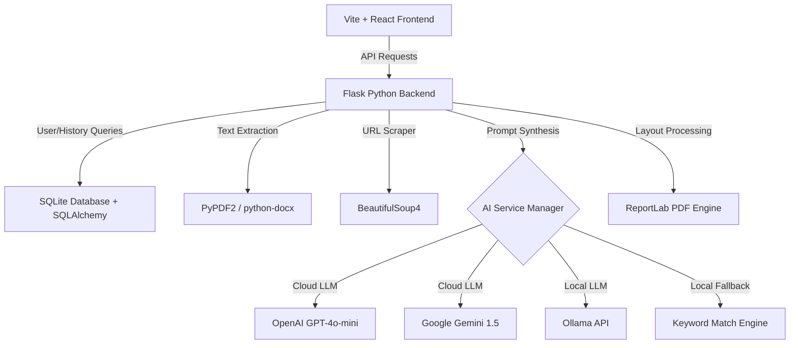

# 🚀 AI Resume Tailor

> **Stop applying. Start landing.**  
> A premium, AI-powered platform designed to optimize your resume for specific job descriptions, parse documents locally, calculate realistic ATS scores, and generate beautifully formatted PDFs in seconds.

[](https://opensource.org/licenses/MIT)
[](https://reactjs.org/)
[](https://vitejs.dev/)
[](https://tailwindcss.com/)
[](https://flask.palletsprojects.com/)
[](https://www.sqlite.org/)

---

## ✨ Features & Capabilities

- **🎯 Intelligent Resume Tailoring**: Leverages advanced LLMs to rewrite your master resume dynamically, highlighting role-relevant skills, experience, and accomplishments.
- **📊 ATS Scoring System**: Calculates match scores (0–100) mathematically using a 4-component weighted model:
  1. *Keyword Match (40%):* Alignment of technical tools and domain skills.
  2. *Layout & Parsability (30%):* Structural scanning capability.
  3. *Quantifiable Accomplishments (20%):* Inclusion of metrics (percentages, numbers, money, time).
  4. *Active Verbs & Impact (10%):* Strong industry action verbs (e.g., *Architected*, *Optimized*, *Spearheaded*).
- **📄 Smart PDF Generation**: Automatic parsing of tailored markdown into clean, professional PDF layouts using **ReportLab** with custom margins, typography, and section spacing.
- **🔗 Job Board URL Scraping**: Automatically extracts job descriptions from LinkedIn, Indeed, and other platforms using **BeautifulSoup4**.
- **🛡️ Multi-Provider AI Engine (Local + Cloud)**:
  - **OpenAI (GPT-4o-mini)**: Dynamic schema validation and full-resume rewrites.
  - **Google Gemini (Gemini 1.5 Flash)**: High-speed cloud alternative.
  - **Local Ollama**: Fully offline processing (supports *Llama 3.1*, *Mistral*, *Gemma*, *Phi 3*).
  - **Mock Engine**: Rule-based fallback that parses keywords locally if no AI providers are configured.
- **📊 Interactive Glassmorphism Dashboard**: Monitor your resume history, calculate average match scores, track applications, and view recent activities.
- **🔑 Dynamic API Key Management**: Swappable OpenAI key settings validated directly from the UI.
- **🔒 Secure Local-First Data**: Hashed user passwords, local SQLite database storage, and private document processing.

---

## 🛠️ Architecture & Tech Stack



### Frontend
- **Core Library**: React 18 with TypeScript
- **Styling**: Tailwind CSS (Premium Glassmorphism Design with Custom Variables)
- **Icons**: Lucide React
- **Build Tool**: Vite

### Backend
- **Framework**: Flask (Python) with Flask-CORS
- **Database ORM**: SQLite with Flask-SQLAlchemy (Declarative Base structure)
- **Document Extractors**: PyPDF2 (PDFs), python-docx (Word documents)
- **Scraper**: BeautifulSoup4 + requests
- **PDF Engine**: ReportLab (SimpleDocTemplate with custom paragraph styling and HRFlowable layout)
- **AI Clients**: `openai`, `google-generativeai`

---

## 📂 Project Structure

```text
├── backend/
│   ├── instance/               # SQLite database location (resume_tailor.db)
│   ├── ai_service.py           # Multi-provider LLM connector (OpenAI, Gemini, Ollama, Mock)
│   ├── app.py                  # Flask REST API endpoints and web server
│   ├── database.py             # SQLAlchemy instance and database initializer
│   ├── models.py               # Database schemas (User, Resume, JobAnalysis, TailoredResume, ActivityLog)
│   ├── requirements.txt        # Backend dependencies
│   ├── resume_generator.py     # Markdown-to-PDF formatting engine using ReportLab
│   ├── setup.py                # Automated installation and environment initialization script
│   ├── test_api.py             # API endpoint integration test suite
│   └── test_backend.py         # Mock-data end-to-end backend test script
├── src/
│   ├── components/
│   │   ├── Analytics.tsx       # UI panel for tracking match score analytics
│   │   ├── ApiKeySettings.tsx  # Dynamic setting panel for custom API keys
│   │   ├── AuthModal.tsx       # Sign-up and Login dialog windows
│   │   ├── Dashboard.tsx       # Main user portal and resume metrics dashboard
│   │   ├── ExportOptions.tsx   # PDF download and clipboard options
│   │   ├── FileUpload.tsx      # Master resume drop-zone
│   │   ├── Header.tsx          # App header
│   │   ├── JobDescriptionInput.tsx # Manual pasting & web scraping inputs
│   │   ├── LandingPage.tsx     # Hero visual page with Quick Start mode
│   │   ├── Navigation.tsx      # Top bar context-aware menus
│   │   ├── PortfolioSuggestions.tsx # Improvement suggestions panel
│   │   ├── ProgressSteps.tsx   # Step-by-step progress wizard indicator
│   │   └── ResumeTailor.tsx    # Core workshop container (states, steps, and API fetch calls)
│   ├── App.tsx                 # Main application shell and routing logic
│   ├── config.ts               # Core app configuration and API URL bindings
│   ├── index.css               # CSS Variables, fonts, glassmorphism theme components
│   └── main.tsx                # App entrypoint
├── start-dev.bat               # Windows batch script to launch E2E dev environment
├── start-simple.bat            # Windows batch script for simplified local runs
├── tailwind.config.js          # Tailwind CSS presets & styling customizations
└── README.md                   # Project documentation
```

---

## 💾 Database Schema

The SQLite schema tracks user profiles, parsed resumes, job descriptions, tailored outputs, and activities:

1. **`User`**: Manages authenticated accounts.
   - `id` (Primary Key, UUID)
   - `email` (Unique String)
   - `password_hash` (Secured using Werkzeug)
   - `name` (String)
   - `created_at` (DateTime)
2. **`Resume`**: Stores original uploaded documents.
   - `id` (Primary Key)
   - `user_id` (Foreign Key -> User)
   - `filename` (String)
   - `original_text` (Text)
   - `parsed_data` (JSON of extracted skills/entities)
3. **`JobAnalysis`**: Caches job listings.
   - `id` (Primary Key)
   - `job_text` (Text)
   - `job_url` (String)
   - `role` / `company` (Strings)
   - `required_skills` (JSON array)
4. **`TailoredResume`**: Connects resumes to jobs.
   - `id` (Primary Key)
   - `resume_id` (Foreign Key -> Resume)
   - `job_id` (Foreign Key -> JobAnalysis)
   - `content` (Markdown Text)
   - `match_score` (Integer)
   - `added_keywords` (JSON array)
5. **`ActivityLog`**: Keeps audit trails.
   - `id` (Primary Key)
   - `user_id` (Foreign Key -> User)
   - `action` / `details` / `timestamp`

---

## ⚡ API Routes

### Authentication
- **`POST /api/auth/register`**: Creates a new user profile.
- **`POST /api/auth/login`**: Authenticates credentials and returns a user token.

### Resume & Job Processing
- **`POST /api/upload-resume`**: Uploads a PDF/DOCX/TXT file and returns extracted text.
- **`POST /api/analyze-job`**: Parses a text block or web scraps a job URL for requirements.
- **`POST /api/tailor-resume`**: Performs an E2E resume optimization using the active AI provider.
- **`POST /api/generate-pdf`**: Standardizes the tailored Markdown resume and compiles a download-ready PDF.

### User Metrics & Settings
- **`GET /api/user/<user_id>/stats`**: Aggregates average scores, application counts, and activity timelines.
- **`POST /api/user/<user_id>/activity`**: Adds user actions to the event database.
- **`POST /api/settings/api-key`**: Validates and overrides the OpenAI API key at runtime.
- **`DELETE /api/settings/api-key`**: Clears the custom key and reverts back to configured fallbacks.
- **`GET /api/health`**: Inspects server status, connection health, and current active AI providers.

---

## ⚙️ Configuration & Environment

Create a `.env` file in the `backend/` directory. Refer to [backend/.env.example](file:///c:/Users/Anush%20Gupta/Documents/GitHub/ai-resume-tailor-1/backend/.env.example) for baseline settings:

```env
# AI Providers (Priority: OpenAI > Gemini > Ollama > Mock)
OPENAI_API_KEY=your_openai_api_key_here
GEMINI_API_KEY=your_gemini_key_here
OLLAMA_URL=http://localhost:11434/api/generate

# Server Configuration
FLASK_ENV=development
FLASK_DEBUG=True
FLASK_PORT=5000
CORS_ORIGINS=http://localhost:5173

# Limits
MAX_FILE_SIZE=10485760
```

---

## 🚀 Getting Started

### Prerequisites
- [Node.js](https://nodejs.org/) (v18 or higher)
- [Python](https://www.python.org/) (v3.9 or higher)

### One-Click Startup (Windows)
Run the dev environment launcher:
```cmd
start-dev.bat
```
*This will automatically check node packages, install python requirements, launch the Flask API server, and launch the Vite Dev server in separate windows.*

### Manual Setup

#### 1. Clone & Set Up Directory
```bash
git clone https://github.com/solmyst/ai-resume-tailor.git
cd ai-resume-tailor
```

#### 2. Configure Backend
```bash
cd backend
python -m venv venv
# Activate virtual environment
# Windows:
venv\Scripts\activate
# macOS/Linux:
source venv/bin/activate

# Install requirements
pip install -r requirements.txt

# Launch Backend Server
python app.py
```
*The API server will listen on `http://localhost:5000`.*

#### 3. Configure Frontend
```bash
# Return to root directory
cd ..
npm install
npm run dev
```
*The client app will open at `http://localhost:5173`.*

---

## 🧪 Testing

The backend includes E2E test suites for API validation:

1. **E2E API Test**:
   ```bash
   cd backend
   python test_api.py
   ```
2. **Mock-Data Flow Integration Test**:
   ```bash
   cd backend
   python test_backend.py
   ```

---

## 🤝 Contributing

Contributions are what make the open-source community such an amazing place to learn, inspire, and create.

1. Fork the Project.
2. Create your Feature Branch (`git checkout -b feature/AmazingFeature`).
3. Commit your Changes (`git commit -m 'Add some AmazingFeature'`).
4. Push to the Branch (`git push origin feature/AmazingFeature`).
5. Open a Pull Request.

---

## 📄 License

Distributed under the MIT License. See `LICENSE` for details.

<p align="center">
  Built with 🖤 by <a href="https://github.com/solmyst">Solmyst</a>
</p>